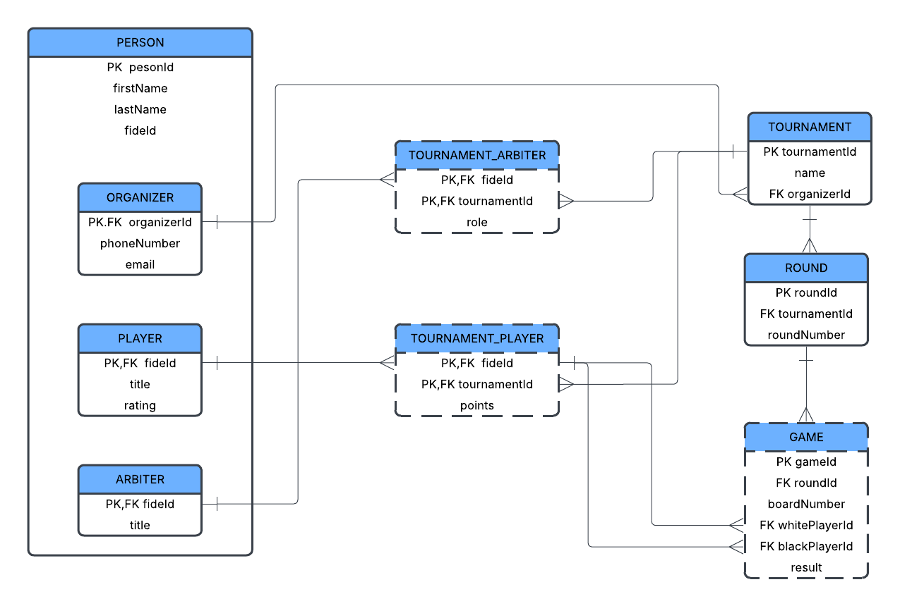

# Chess-Arena-Manager
**Chess Arena Manager** is an application for managing chess tournaments.

## Available Methods

### 🔹 General
- **exitApp()**  
  Closes the application and saves audit logs.

---

### 🔹 Tournaments

1. **showAllTournaments()**  
   Displays a list of all tournaments with their associated organizers.

2. **createTournament()**  
   Creates a new tournament by providing a name and selecting an existing organizer.

3. **deleteTournament()**  
   Deletes a tournament by specifying its ID.

4. **showTournamentStartingList()**  
   Displays the list of players registered in a specific tournament, sorted by rating.

5. **createTournamentPlayer()**  
   Adds a player to a tournament using their FIDE ID. Creates the player if they do not already exist.

6. **deleteTournamentPlayer()**  
   Removes a player from a tournament based on their FIDE ID.

7. **createTournamentArbiter()**  
   Assigns an arbiter to a tournament by FIDE ID and sets their role (e.g., Chief, Second).

8. **deleteTournamentArbiter()**  
   Removes an arbiter from a tournament.

9. **showTournamentArbiters()**  
   Displays all arbiters assigned to a specific tournament.

10. **startTournament()**  
    Starts the tournament and generates pairings using the round-robin system.

11. **showRounds()**  
    Shows all pairings (matches) per round for a selected tournament.

12. **setPlayersPoints()**  
    Allows the user to input points for each player in each round of a tournament.

13. **showRanking()**  
    Displays the tournament ranking table, sorted by points and rating.

---

### 🔹 Players

14. **showAllPlayers()**  
    Displays a list of all registered players.

15. **createPlayer()**  
    Creates a new player with name, FIDE ID, title (optional), and rating.

16. **updatePlayer()**  
    Updates details of an existing player.

17. **deletePlayer()**  
    Deletes a player from the system by FIDE ID.

---

### 🔹 Arbiters

18. **showAllArbiters()**  
    Displays all registered arbiters.

19. **createArbiter()**  
    Creates a new arbiter using a FIDE ID and optional title (e.g., IA, FA).

20. **updateArbiter()**  
    Updates the title of an existing arbiter.

21. **deleteArbiter()**  
    Deletes an arbiter from the system.

---

### 🔹 Organizers

22. **showAllOrganizers()**  
    Displays all organizers.

23. **createOrganizer()**  
    Creates a new organizer by providing contact details.

24. **updateOrganizer()**  
    Updates the contact details of an existing organizer.

25. **deleteOrganizer()**  
    Deletes an organizer from the system.

---

### 🔹 Persons

26. **showAllPeople()**  
    Displays all persons in the database (players, arbiters, organizers).

27. **createPerson()**  
    Adds a generic person entry (used as base for player, arbiter, or organizer).

28. **updatePerson()**  
    Updates basic information (first name, last name, FIDE ID) of a person.

29. **deletePerson()**  
    Deletes a person from the system, only if they are not linked to other roles.

---

### Available pairing-systems
#### -Round-Robin

---

# 🛠️ Technical Details
- **Language**: Java 21.0.6 (LTS)
- **Runtime**: Java SE Runtime Environment (build 21.0.6+8-LTS-188)

---
## 🗄️ Database

- **Database**: MySQL (using InnoDB engine, `utf8mb4` collation)
- **Database Connectivity**:  
  Uses standard **JDBC** with `java.sql` API and  
  **MySQL Connector/J 9.3.0** (`mysql-connector-j-9.3.0.jar`)

### 📦 SQL Scripts

- [Database schema (`CREATE TABLE`)](src/sql/schema.sql)
- [Sample data (`INSERT` statements)](src/sql/data.sql)

---
## 🧾 Audit Logging

- **Format**: CSV file (`audit.csv`)
- **Mechanism**: Written using standard Java `FileWriter`
- **Content**: Each logged entry contains:
  - Action name (e.g., "Create tournament with id "+generatedTournamentId)
  - Timestamp of execution
